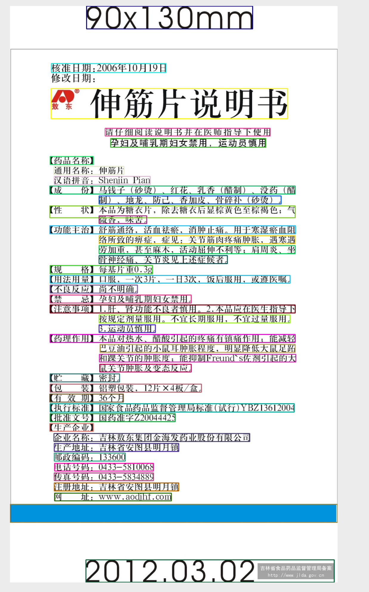
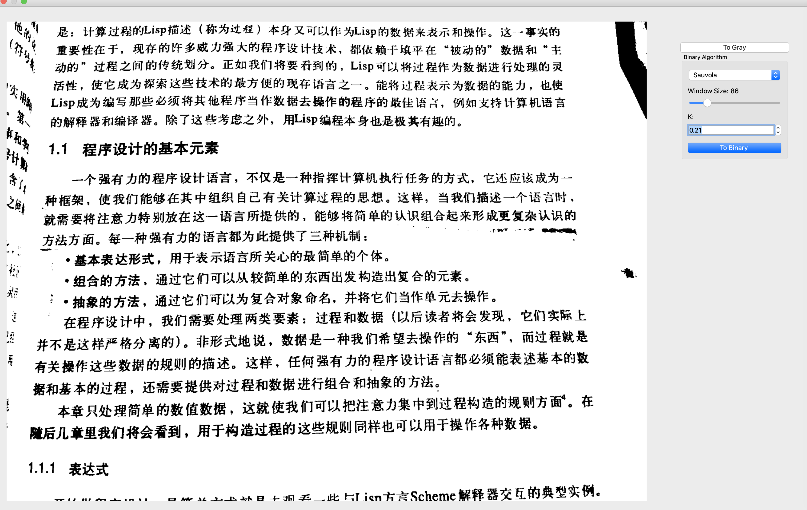
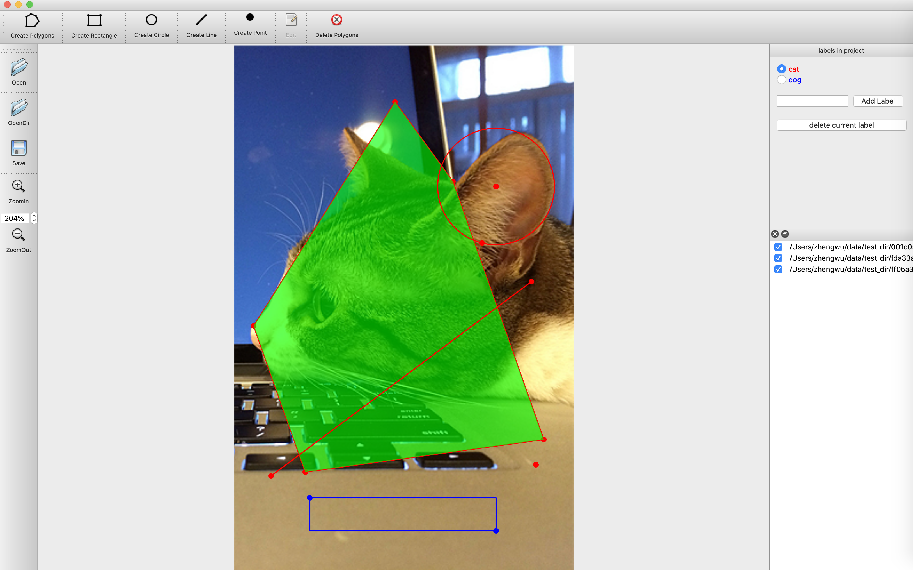

This is a image label tool  especially for document analysis or OCR task. It just a common label tool for object detection or image segmentation so far,  some features about document analysis will be implement later;

### auto label 
   can use tesseract to auto label the text line 
   

### binary algorithm:

 - Otsu - "A threshold selection method from gray-level histograms", 1979.
 - Bernsen - "Dynamic thresholding of gray-level images", 1986.
 - Niblack - "An Introduction to Digital Image Processing", 1986.
 - Sauvola - "Adaptive document image binarization", 1999.
 - Wolf - "Extraction and Recognition of Artificial Text in Multimedia Documents", 2003.
 - NICK - "Comparison of Niblack inspired Binarization methods for ancient documents", 2009.
 - ISauvola - "ISauvola: Improved Sauvola’s Algorithm for Document Image Binarization", 2016.
 - WAN - "Binarization of Document Image Using Optimum Threshold Modification", 2018.

result:

This project write by c++ use QT5, but some function translate from [labelme](https://github.com/wkentaro/labelme)
and inspired by project [deeplabel](https://github.com/jveitchmichaelis/deeplabel)
